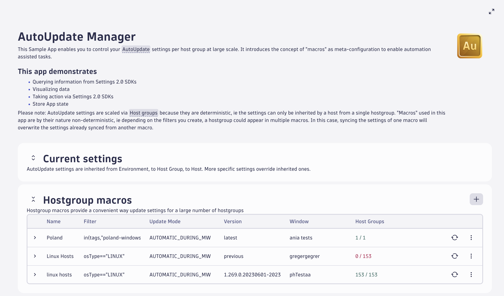

# AutoUpdate Manager Sample 
This Sample App enables you to control your OneAgent AutoUpdate settings per host group at large scale. It introduces the concept of "macros" as meta-configuration to enable automation-assisted tasks.

## This app demonstrates
- Querying information from Settings 2.0 SDKs
- Visualizing data
- Taking action via Settings 2.0 SDKs
- Store App state

## Support
Please note that the app is intended mostly for educational purposes and should not be used as-is for production scenarios. It is covered under the “light support” provisions of the Dynatrace terms and conditions.

## TL;DR
You can start using this Sample App now:
1. Clone this repo to your localhost
2. Edit `app.config.ts` to point to your environment
3. Test locally: `npm run start`
4. Deploy using `npm run deploy`
